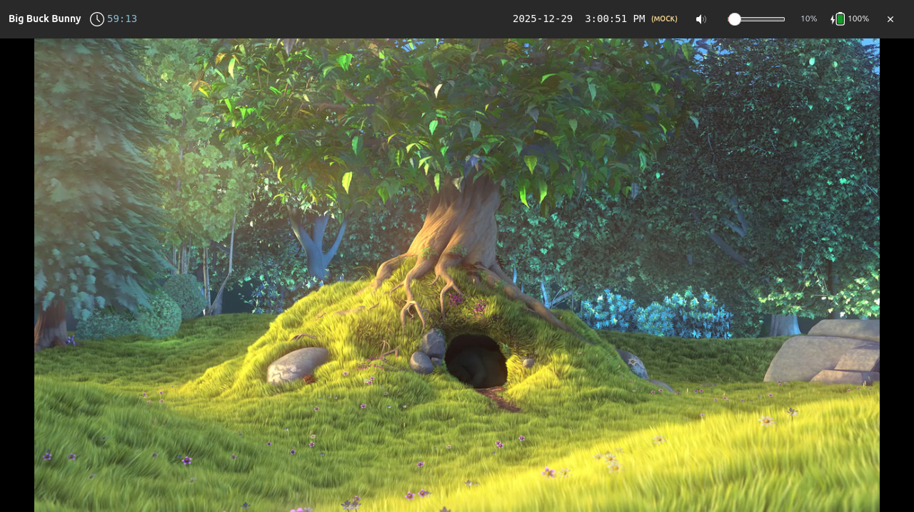
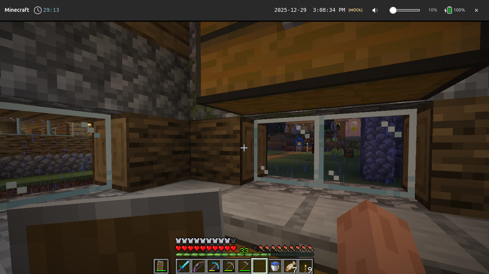

# shepherd-launcher

A child-friendly, parent-guided launcher for Wayland, allowing supervised
access to applications and content that you define.

Its primary goal is to return control of child-focused computing to parents,
not software or hardware vendors, by providing:

* the ease-of-use of game consoles
* access to any application that can be run, emulated, or virtualized in desktop Linux
* with granular access controls inspired by and exceeding those in iOS Screen Time

While this repository provides some examples for existing software packages
(including non-free software and abandonware), `shepherd-launcher` is
*non-prescriptive*: as the end user, you are free to use them, not use them,
or write your own.

## Screenshots

### Home screen

`shepherd-launcher` presents a list of activities for the user to pick from.


The flow of manually opening and closing activities should be familiar.

["Happy path" demo showing home screen --> GCompris --> home screen](https://github.com/user-attachments/assets/1aed2040-b381-4022-8353-5ce076b1eee0)

Activities can be made selectively available at certain times of day.


This example, shown at 9 PM, has limited activities as a result.

### Time limits

Activities can have configurable time limits, including:
* individual session length
* total usage per day
* cooldown periods before that particular activity can be restarted

[TuxMath session shown about to expire, including warnings and automatic termination](https://github.com/user-attachments/assets/541aa456-ef7c-4974-b918-5b143c5304c3)

### Anything on Linux

If it can run on Linux in *any way, shape, or form*, it can be supervised by
`shepherd-launcher`.



> [Big Buck Bunny](https://peach.blender.org/) playing locally via `mpv`


> [Putt Putt Joins the Circus](https://humongous.fandom.com/wiki/Putt-Putt_Joins_the_Circus)
> running via [ScummVM](https://www.scummvm.org/)


> [The Secret of Monkey Island](https://en.wikipedia.org/wiki/The_Secret_of_Monkey_Island)
> running via [ScummVM](https://www.scummvm.org/)



> [Minecraft](https://www.minecraft.net/) running via the
> [mc-installer Snap](https://snapcraft.io/mc-installer)


> [Celeste](https://www.celestegame.com/) running via Steam


> [A Short Hike](https://ashorthike.com/) running via Steam

Contributions are welcome for improvements and not yet implemented backends,
such as:
* Content-aware media player with supervised libraries [TODO: link to issue]
* Pre-booted Steam to improve launch time [TODO: link to issue]
* Android apps via Waydroid, including pre-booting Android if necessary [TODO: link to issue]
* Legacy Win9x via DOSBox, QEMU, or PCem, including scripts to create a boot-to-app image [TODO: link to issue]
* Chrome, including strict sandboxing and support for firewall rules [TODO: link to issue]
* Awareness of whether an Internet connection is available, and an availability
  rule that gates activities based on this [TODO: link to issue]
* Porting to other *host* platforms, such as a Microsoft Windows shell
  replacement or macOS kiosk via MDM. `shepherd-launcher` is architected such
  that `shepherdd`, the core enforcement service, does not render any UI and
  performs platform-specific functions like process management in
  platform-specific crates.

## Core concepts

* **Launcher-first**: only one foreground activity at a time
* **Time-scoped execution**: applications are granted time slices, not unlimited sessions
* **Parent-defined policy**: rules live outside the application being run
* **Wrappers, not patches**: existing software is sandboxed, not modified
* **Revocable access**: sessions end predictably and enforceably

## Non-goals

* Modifying or patching third-party applications
* Circumventing DRM or platform protections
* Replacing parental involvement with automation

## Installation

`shepherd-launcher` is pre-alpha and in active development. As such, end-user
binaries and installation instructions are not yet available.

See [CONTRIBUTING.md](./CONTRIBUTING.md) for how to run in development.

Contributions are welcome for:
* a CI step that generates production binaries [TODO: link to issue]
* an installation script [TODO: link to issue]

## Example configuration

All behavior shown above is driven entirely by declarative configuration.

For the Minecraft example shown above:

```toml
# Minecraft via mc-installer snap
# Ubuntu: sudo snap install mc-installer
[[entries]]
id = "minecraft"
label = "Minecraft"
icon = "minecraft"

[entries.kind]
type = "snap"
snap_name = "mc-installer"

[entries.availability]
[[entries.availability.windows]]
days = "weekdays"
start = "15:00"
end = "18:00"

[[entries.availability.windows]]
days = "weekends"
start = "10:00"
end = "20:00"

[entries.limits]
max_run_seconds = 1800  # 30 minutes (roughly 3 in-game days)
daily_quota_seconds = 3600  # 1 hour per day
cooldown_seconds = 600  # 10 minute cooldown

[[entries.warnings]]
seconds_before = 600
severity = "info"
message = "10 minutes left - start wrapping up!"

[[entries.warnings]]
seconds_before = 120
severity = "warn"
message = "2 minutes remaining - save your game!"

[[entries.warnings]]
seconds_before = 30
severity = "critical"
message = "30 seconds! Save NOW!"
```

See [config.example.toml](./config.example.toml) for more.

## Development

See [CONTRIBUTING.md](./CONTRIBUTING.md)

## Written in 2025, responsibly

This project stands on the shoulders of giants in systems software and
compatibility infrastructure:

* Wayland and Sway
* Rust
* Snap
* Proton and WINE

This project was written with the assistance of generative AI-based coding
agents. Substantial prompts and design docs provided to agents are disclosed in
[docs/ai](./docs/ai/).
