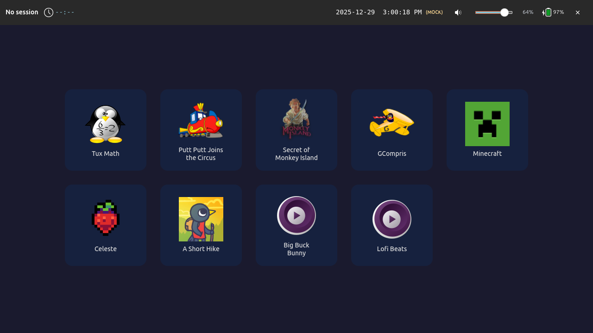

**shepherd-launcher has moved.**

All development and distribution now take place at
<https://git.armeafamily.com/albert/shepherd-launcher>.

# shepherd-launcher

A child-friendly, parent-guided desktop environment for Wayland,
allowing supervised access to applications and content that you define.

Its primary goal is to return control of child-focused computing to parents,
not software or hardware vendors, by providing:

* the ease-of-use of game consoles
* access to any application that can be run, emulated, or virtualized in desktop Linux
* with granular access controls inspired by and exceeding those in iOS Screen Time

If you cannot access the page or clone the repository at the above URL, your region likely requires
operating system components to collect user data for age verification.
Such requirements compromise user privacy and parents' ability to make decisions on behalf of children.

Because of this, shepherd-launcher will not implement age verification and
cannot be distributed in regions that require it by law.

A copy of the notice that is shown in such regions is available
[here](./451.pdf).
